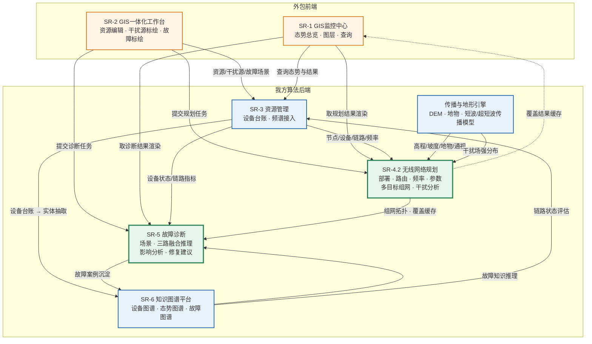
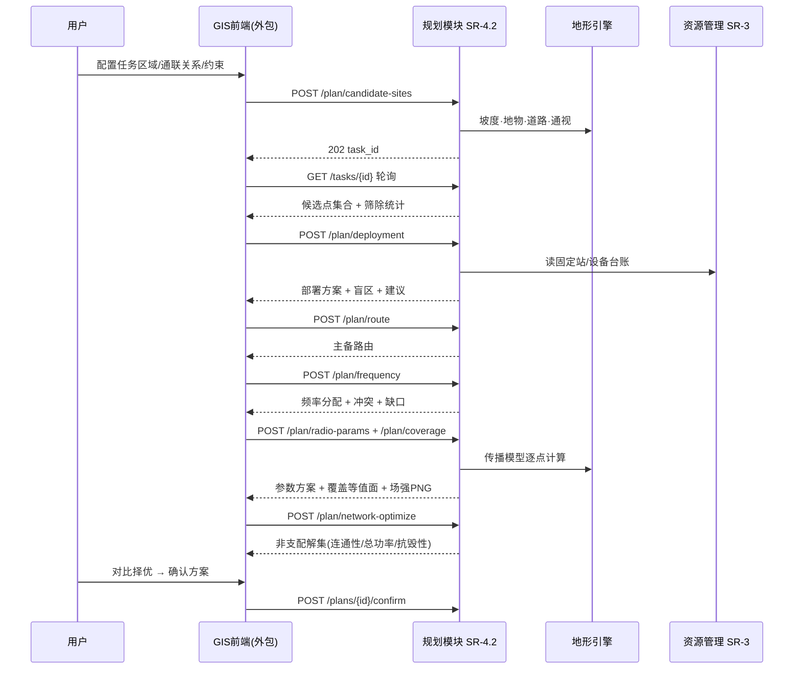
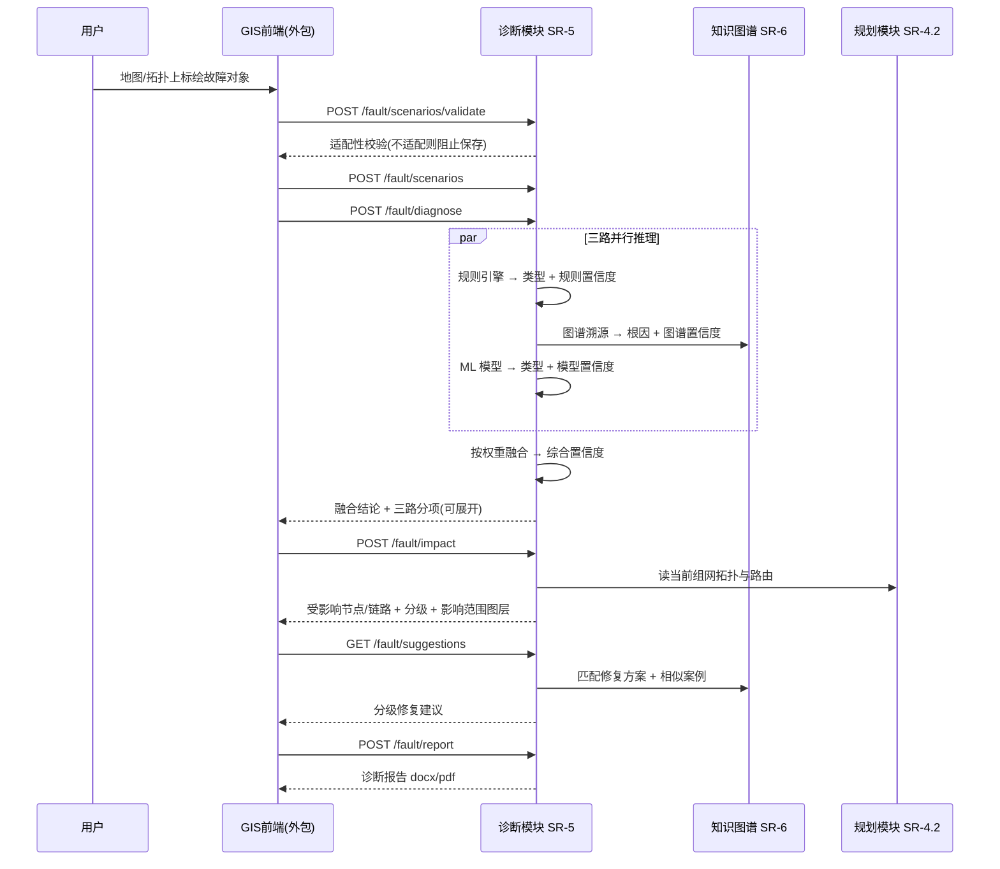

# 模块接口关系说明 v0.1

> 第 1 周交付物之一。说明各 SR 模块的职责边界、依赖关系与数据流向，
> 明确**我方算法后端**与**外包前端**的分工界面。
> 接口的具体出入参见 `docs/03_接口文档.md`。

---

## 1. 职责划分

| 模块 | 软需 | 承担方 | 说明 |
|---|---|---|---|
| GIS 监控中心 | SR-1 | **外包** | 只读态势总览、图层控制、资源查询 |
| GIS 一体化工作台 | SR-2 | **外包** | 资源增删改、干扰源标绘、故障标绘 |
| 资源管理 | SR-3 | 我方（数据层） | 短波/超短波设备台账、频谱数据接入 |
| **无线网络规划** | **SR-4.2** | **我方（核心）** | 部署、路由、频率、参数、多目标组网、干扰分析 |
| **故障诊断分析** | **SR-5** | **我方（核心）** | 场景、三路融合推理、影响分析、修复建议 |
| **知识图谱平台** | **SR-6** | **我方** | 设备/态势/故障三类图谱，为 SR-5 提供推理支撑 |
| 系统管理 | SR-7 | 外包 | 账号、日志、参数配置 |

**分工界面**：外包方负责一切**看得见的东西**（地图、面板、表单、图层渲染），
我方负责一切**算出来的东西**（规划方案、诊断结论、覆盖场强、知识推理）。
两者之间只通过 `docs/03_接口文档.md` 定义的 HTTP 接口交互，不共享数据库表。

---

## 2. 模块依赖关系



**关键依赖**（虚线为弱依赖，可延后打通）：

| 依赖 | 说明 | 打通时间 |
|---|---|---|
| SR-3 → SR-4 | 规划的全部输入（节点、设备、链路、频率池）来自资源台账 | 第 2 周 |
| 地形引擎 → SR-4 | 候选点筛选、通视判断、覆盖计算的地形基础 | 第 2 周（依赖 DEM） |
| SR-4 → SR-5 | 影响分析要沿**规划后的组网拓扑**推演，不是原始拓扑 | 第 5 周 |
| SR-6 → SR-5 | 三路融合中的图谱推理路 | 第 5 周 |
| SR-5 → SR-6 | 诊断结果回沉为案例，供 ML 路训练 | 第 6 周 |
| SR-4 → SR-1 | 覆盖结果缓存供前端直接读取，**不重复发起全网计算** | 第 4 周 |

> 最后一条是软需 SR-1.1.2.6.2 c 的明确要求："覆盖数据读取规划模块的计算结果缓存，
> 不独立发起实时全网计算"。前端图层不能触发算法计算 —— 这条要在联调时盯住，
> 否则用户拖动地图就会打爆算法服务。

---

## 3. 两条主流程的数据流

### 3.1 无线网络规划流程（SR-4.2）



**顺序是强制的**：候选点 → 部署 → 路由 → 频率 → 参数/覆盖 → 多目标组网。
SR-4.2.4 明确写了多目标组网是"在车载站部署与频率资源分配完成的基础上"进行，
不能跳步。前端应把这个顺序做成向导式步骤条，并允许分步回退（SR-4.2 扩展流 2）。

### 3.2 故障诊断流程（SR-5）



**ML 路的降级是常态而非异常**：历史案例未达门限时，融合自动降为规则+图谱两路，
返回 `fusion_mode = TWO_WAY_DEGRADED`。前端**必须显示当前融合路数**
（SR-5.2 扩展流 1）。按目前进度，第 5 周首版大概率就是两路降级运行。

---

## 4. 接口清单与实现节奏

| 接口 | 对应软需 | 依赖 | 计划周次 |
|---|---|---|---|
| `POST /plan/candidate-sites` | SR-4.2.1.1 | DEM、地物、道路 | 第 2 周 |
| `POST /plan/deployment` | SR-4.2.1.2 | 候选点、通联需求 | 第 2 周 |
| `POST /plan/route` | SR-4.2.2.1 | 部署方案、拓扑 | 第 3 周 |
| `POST /plan/frequency` | SR-4.2.2.2 | 路由、频率池 | 第 3 周 |
| `POST /plan/radio-params` | SR-4.2.3 | 部署方案、地形 | 第 3 周 |
| `POST /plan/coverage` | SR-4.2.3 c | 传播模型、DEM | 第 2–3 周 |
| `POST /plan/network-optimize` | SR-4.2.4 | 部署 + 频率 | 第 4 周 |
| `POST /interference/analyze` | SR-4.2.5 | 组网方案、干扰源 | 第 4 周 |
| `POST /fault/scenarios*` | SR-5.1 | 拓扑、设备 | 第 5 周 |
| `POST /fault/diagnose` | SR-5.2 | 规则库、图谱、案例 | 第 5 周 |
| `POST /fault/impact` | SR-5.3 | 组网拓扑、路由 | 第 5 周 |
| `GET /fault/suggestions` `POST /fault/report` | SR-5.4 | 图谱、诊断结论 | 第 6 周 |
| `/kg/*` | SR-6 | 图谱数据 | 第 5 周 |

---

## 5. 需要外包方确认的对接事项

见 `docs/03_接口文档.md` 第 5 节，共 7 项。其中三项若不尽早确认会返工：

1. **覆盖结果传输格式** —— 120×120 km @30 m 是 1600 万个栅格点，
   不可能走 JSON。方案是等值面 GeoJSON + 带 bbox 的 PNG 双通道，需确认前端能叠加图片图层。
2. **坐标序** —— `[lon, lat]` 还是 `[lat, lon]`。不确认必出错，且是最难查的那类错。
3. **三路融合结果的展示位** —— SR-5.2 要求可展开查看分项结论与置信度，
   前端需预留展开区域，不能只显示一个最终结论。

---

## 6. 我方内部模块划分（代码组织）

```
scripts/
  terrain.py            地形引擎：高程·坡度·地物·通视 (DEM 到位后换 DemTerrain)
  propagation.py        传播模型：超短波绕射 / 短波地波+NVIS / 链路预算
  gen_test_data.py      测试数据生成
  validate_data.py      数据校验

（第 2 周起新增）
  planning/
    candidate.py        SR-4.2.1.1 候选点筛选
    deployment.py       SR-4.2.1.2 部署规划
    routing.py          SR-4.2.2.1 路由规划
    frequency.py        SR-4.2.2.2 频率分配
    radio_params.py     SR-4.2.3   参数优化 + 覆盖
    multiobj.py         SR-4.2.4   多目标组网
    interference.py     SR-4.2.5   干扰分析
  diagnosis/
    scenario.py         SR-5.1
    inference/          SR-5.2  rule.py / kg.py / ml.py / fusion.py
    impact.py           SR-5.3
    suggestion.py       SR-5.4
  kg/                   SR-6
  api/                  HTTP 接口层 + 异步任务框架
```

传播与地形引擎被规划、干扰分析、故障诊断三处复用，是全项目**唯一的物理计算入口**，
其接口（`path_loss` / `link_budget` / `los_clearance`）在第 2 周替换真实模型时保持不变。
